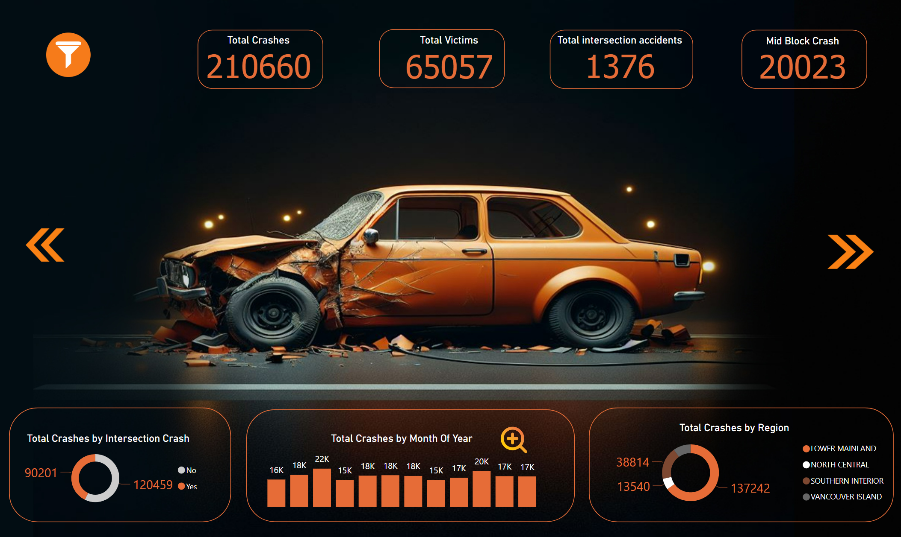

# ICBC-Accidents-Power-BI

### The Insurance Corporation of British Columbia (ICBC) publishes records for all reported crashes in British Columbia, Canada.  
### The dataset includes the month, year, time of day, location, and other information on the crashes (number of vehicles, whether pedestrians or cyclists were involved, etc.).  

## Time/Date related columns:

Date Of Loss Year => Year 
Month Of Year => Month 
Day Of Week => Weekday 
Time Category => Time Period  
. 

## Location based columns:

Region  
Municipality Name  
Municipality Name  
Road Location Description  
Street Full Name  
Street Full Name  
Cross Street Full Name  
Latitude  
Longitude  
Total Crashes -> Total number of individual crashes related to this record.  
Total Victims -> Total number of individuals injured or killed related to this record.  
. 
. 
## Link to the dataset - https://www.kaggle.com/datasets/tcashion/icbc-vehicle-crash-dataset  

# DASHBOARD_1

# DASHBOARD_2

# Insights
## 1) LOWER MAINLAND has the maximum number of crashes. 
## 2) Most crashes were on MID BLOCK compared to Intersection.
## 3) SURREY had the maximum crashes.
## 4)In 22% of cases of accidents, casualties occurred.
## 5) 4.69% of crashes involve Heavy vehicles.
## 6) 4.96% of crashes involve Animals.
## 7) 1.10% of crashes involve pedestrians.
## 8) There are average 17423 accidents per month

